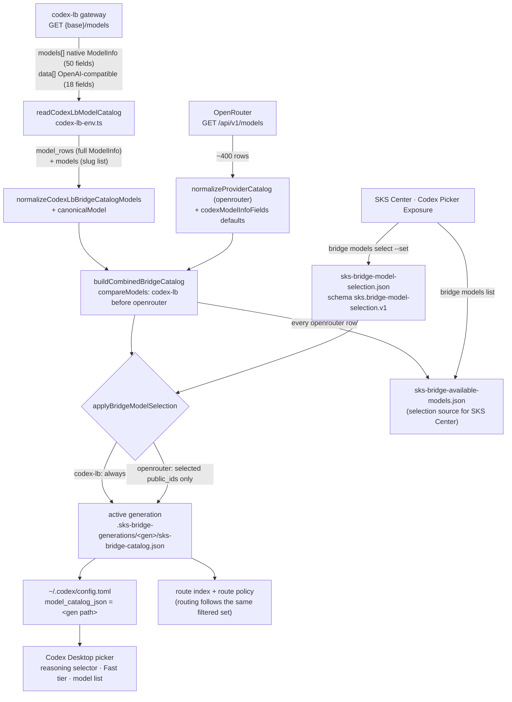
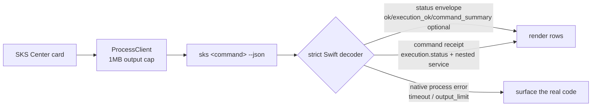

# Model catalog and picker wiring

How a provider model becomes a row in the Codex Desktop picker, and where the
8.3.2/8.3.3 defects sat. Read this before changing catalog normalization, the
Swift truth decoders, or Doctor's repair phases.

## Catalog build path

Two properties this path must keep:

- **Routing and exposure share one source.** The active catalog feeds both the
  picker and the route index, so a model that is not exposed is also not
  routable. There is no hidden second list.
- **Provider rows are preserved, never rebuilt.** The gateway already serves a
  complete Codex ModelInfo row. SKS layers routing identity (`provider_id`,
  `route_key`, `public_id`) on top and passes everything else through.

## SKS Center read path

The decoders are exact-key contracts. Any new top-level CLI field must be added
to the allowed key set in the same change, or every affected card fails closed
and renders "schema invalid".

## Defects this wiring encodes

| Symptom | Root cause | Fix |
| --- | --- | --- |
| Picker had no reasoning levels; Fast mode missing for Codex-LB | Gateway response carries `models` **and** `data`; the parser read `data` (18 fields), then the normalizer and `canonicalModel` rebuilt only the required subset | Prefer `models`; preserve upstream rows in both normalizer and `canonicalModel` |
| Picker buried Codex-LB behind ~389 OpenRouter rows | Unfiltered catalog plus alphabetical merge | `compareModels` orders codex-lb first, ModelInfo `priority` 100, and OpenRouter exposure became opt-in |
| Combined Catalog "Refresh" reported schema invalid | Envelope trio was made *required* on the status decoder, but the status nested in a command result never carries it | Allowed-and-type-checked, never required |
| Provider rows stuck on "checking…" | Same decoder, live `bridge status` path | Same fix |
| Center actions timed out on routing-aware commands | 64KB `ProcessClient` cap vs ~120KB catalog-aware JSON | 1MB cap |
| `doctor --fix` printed `retry_catalog_sync` but never repaired | No repair phase existed for a stale catalog | `desktop_bridge_catalog_repair` phase |
| `doctor --fix` deleted `openai_base_url` and `notify` | Doctor rooted at `$HOME` made the project-local stripper resolve onto the global config | Project pass skips the codex home config |
| Run Doctor button appeared inert | `doctor --json` selects the fast read-only profile and skips every deep diagnostic | Runs `doctor --full --json` |
